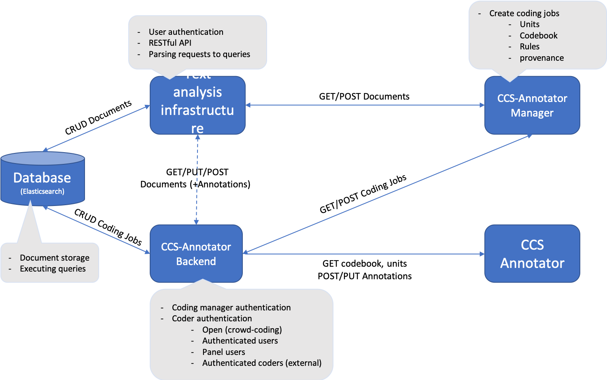

# Usage Manual for CCS Annotator

## Intro

## Installation and Run

Installation should be straightforward via npm.

```bash
git clone https://github.com/ccs-amsterdam/CCS_annotator
cd CCS_annotator
npm install
npm start
```

Depending on your env, you might have to run `npm install --only=dev` to install dev dependencies.

- Currently there is a new error for npm installs for Mac users. If after installation you still cannot reach the webclient, run `unset HOST` in your terminal before `npm start`. Here is the link to the open issue: [a link](https://github.com/facebook/create-react-app/issues/9619).

## CCS Annotator Modules


