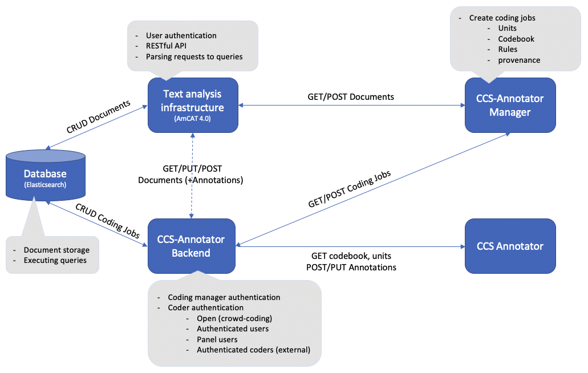
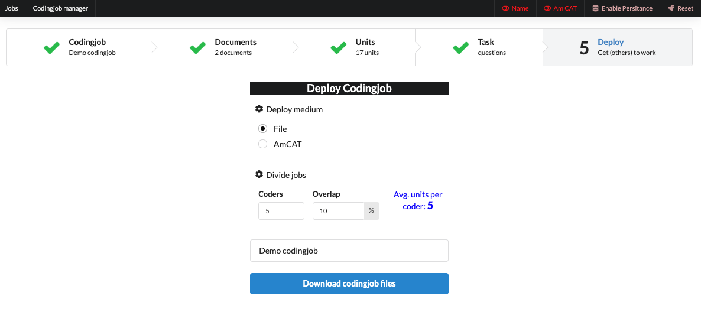

# Usage Manual for CCS Annotator

## Intro

CCS Annotator is a tool for manual content analysis that is targeted specifically at the Computational Communication Science (CCS) community. CCS Annotatoris is designed to make the annotation tasks that our field (CCS) requires easier and more efficient to set-up and deploy, and to facilitate the development of reusable and shareable codebooks. It can be used by itself using only a standard web-browser, requiring no installation for either the researcher or coders. An additional CCS Annotator server backend can be installed for fast and efficient distribution of jobs and collection of results. CCS Annotator supports various annotations modes, ranging from expert tasks such as labeling specific words and phrases, to simple crowd coding tasks like Tinder style swiping on mobile phone.

### CCS Annotator Modules

Depending on the applicaiton and its requirements, CCS Annotator can have various setups. The most complete (and powerful) version is depicted below:



In this setup, there are 5 modules composing the CCS Annotator: CCS Annotator Manager (mandatory), CCS Annotator (Optional), Text Analysis Infrastructure (optional), CCS Annotator Backend (optional), and the Databset (optional). The mandatory modules are always required for any setup, while the optional ones can be substituted and modified depending on the application. Note that currenlty the CCS Annotator module is hosted on Github by us, thus no installation is required from you. If you wish to set up your own CCS Annotator module, you can do so on another server and change the host in the CCS Annotator Manager. Few alternative setups are depicted in the figure below:


For more information about CCS Annotator modules, check here: [Extended Abstract ICA](extended-abstract-papaer)

## Installation and Run

Installation should be straightforward via npm.

```bash
git clone https://github.com/ccs-amsterdam/CCS_annotator
cd CCS_annotator
npm install
npm start
```

Depending on your env, you might have to run `npm install --only=dev` to install dev dependencies.

- Currently there is a new error for npm installs for Mac users. If after installation you still cannot reach the webclient, run `unset HOST` in your terminal before `npm start`. Here is the link to the open issue: [Github Issue](https://github.com/facebook/create-react-app/issues/9619).

## Usage Manual

The rest of this document provides a usage manual for CCS Annotator. Note that this manual concerns the base version (pulled from the GitHub repo) without any additional changes and modifications.

## CCS Annotator Manager

The CCS Annotator Manageris an mandatory component in which researchers can create coding jobs. Note that, coding jobs can also be created in software such as R or Python, for which we are working on a separate package and module, respectively.

To access the CCS Annotator Manager, first you need to run `npm start` in the project directory (check the installation guide). Afterwards, open a browser and visit `localhost:3000/CCS_Annotator`. The first time you do this, you come across the following page:


From the navigation pane on the top of this page, you can navigate through different steps of the process.

- **CodingJob**: You can create a new coding job by either clicking the **Create Demo Job**, or create one from scratch. In the latter case, you need to give the coding job a name.
- **Documents**: You can upload the documents you intend to annotate in this tab (in .csv format). In case you have already uploaded some documents, they will also be displayed in this page.


- **Units**: In the units page, you can determine the setup and specifics of the coding job you are intending to execute.


- In the **Define Coding Units** section, you can determine the granularity of the annotation you need, the options are document (using the whole document for annotation), paragraph (separating each document in annotatable paragraphs), and sentence (separating each document in annotatable sentences). You can also choose the **context unit** in which each annotation unit is displayed. For document, the context unit is always the whole document. However, for paragraph and sentence you can choose up to how many context units before and after the annotation unit you want to be displayed to the user (AKA the coder).


- In the **Coding Unit Layout** section you can customize the label, font, and styling of the test in the annotation units.
- In the **Select Units** section you can choose the randomization setting for the units. This affects how annotation units are selected and returned to the coders for annotation. You can choose the number of units per coder, randomization (and its seed), and sampling approach (balanced or on balanced). Consult the on-screen guide (under the question mark sign) for more information.
- In the **Unit Preview** section you can see how the units will look like to the coders. You can also scross through them using the navigation bar on top of this section.
- **Task**: In this tab, you can choose your annotation task type, and create your code book (and modify it if already created).


-- In the **Settings** section, you can select you task type (annotation mode). The current version supports two modes for coding texts. The _annotate_ mode lets coders assign labels to specific word or phrases. The below figure shows what this looks like for a task where coders can label topics and actors. For simple tasks, coders can intuitively select words with their mouse or touchpad (mobile), but faster keyboard navigation is also supported. On selection, a pop up lets users assign the label via an selected interface. For a small number of options this can be buttons. For a large number of options, this can also be a search box, and the codebook can have a tree structure to more easily search within categories.


You can also modify the codebook, add variables, change the tree structure of the codebook, and add additional codes.

The _question_ mode lets coders answer one or multiple (branching) questions about a given piece of text. Various formats for types of questions are available, and our goal is to add more and empirically test their efficacy for particular coding tasks. A key design principle for this annotation mode is that every type of question is fully and intuitively mobile phone compatible. Figure below illustrates what this looks like fora task where coders first answer whether/what topic is present in a sentence with buttons, and second whether/which actor is mentioned using a searchable list with a hierachical codebook. Only if both topic and actor are present, a follow up question would inquire about whether/what stance the actor takes on the issue.


In this mode, you cann add questions for each unit, and see how it is displayed on the preview tab. You can also choose to have three different modes of answering the question: (i) selecting code from a search box, (ii) selecting the code with buttons, and (iii) annoTinder, where you can swipe for yes/no questions.

- **Deploy**: In this page, you can choose how you want to deploy the coding job (refer to the CCS Annotator modules for more details).
  -- If you choose the **File** option, you will be able to indicate the number of coder and the overlap, and in turn are able to download a zip file containing the coding job (units + codebook) for each coder. This zip file can be used for with other annotation systems, or the Annotator module.



-- if you choose the **AmCAT** option, you can store your coding jobs on AmCAT, and use the functionalities that it provides (safe storage, access control) for your annotation job.


Note that in this case, you need to have a running AmCAT server. Visit [AmCAT 4.0 GitHub Repo](https://github.com/ccs-amsterdam/amcat4) for more details. To login to AmCAT, use the AmCAT tab on the top of the page. After a successfull login, you are returned to the deploy page, where you can give a name to your coding job, and upload it to AmCAT. After this, you can see the link of the coding job, as well as a QR-code which can be distributed to the coders.


## CCS Annotator

The CCS Annotator functions as a webpage where the coding itself takes place. Coders can either follow a link to a coding job, or upload a coding job from a file. This link is the same one generated by the CCS Annotator Manager after coding job deployment.

Upon entering the URL on your (coder's) browser, the page prompts you to input a user name. This user name is stored with the coders annotations in order to track the job by each coder (for more advanced modes of authentication and authorization, check the Access Control section below). After this step, the coder can choose either the _fullscreen_ or the _windowed_ mode, the latter of which is useful for coders who use their smart phone for coding.

### Annotation task

If the coding job is an annotation task, the coder will see a webpage similar to this:


When the coder click on any work within the text, a pop-up window will appear with the possible codes (based on the codebook). Additionally, the coder can see the coded tokens (and their code) in the right hand side table. Lastly, the coder can click on the instructions button, whereby another pop-up window will appear showing the keyboard shortcuts for annotation. After the coder is finished annotating the current unit, the _NextUnit_ button will load the next unit to be annotated. The progress bar on top of the page shows the current status of the annotation task. Upon annotating the final unit, the finish button informs the coder that the job is finished.

### Question task

If the coding job is an question task, the coder will see a webpage similar to this:


The instructions for this task is relatively easier, as the coder only needs to click on the right answer for the question. Similar to the annotation task, the progress bar on top of the page shows the current status of the annotation task. Upon annotating the final unit, the finish button informs the coder that the job is finished.

## Advanced Usage

In this section we discuss few more advance topics when using the CCS Annotator.

### Creating a Codebook

### Question Branching

### Access Control

Currenlty, there are three modes of access control supported by the CCS Annotator. Note that for these modes, you need the full implementation of the CCS Annotator + AmCAT. These modes are indicated when creating the coding book in the **rules** section. three modes are:

- **user**: This mode is mostly used in crowd-coding scenarios, where the users are only asked for a (unique) username, and their annotations are stored alongside their username. This way, the annotaions, their quality, and coders' contribution (and maybe compensation) can be calcualted when the job is finished.
- **user_pass**: This mode is used when there are a list of pre-determined users (for instance in an expert study) who have access to the coding job. These users are added to the AmCAT by the CCS Annotator Manager before the access link is shared. Note that this authentication marks the difference between _public_ coding jobs (crowd-coding) and _private_ jobs.
- **token**: This mode can be used where the coding job is private, but there is no need to pre-determine the coders and add them to AmCAT. For instance, this mode can be used when the coding job is for a class of students, but no one outside of it. In this mode a token is given alongside the access link, which acts as the authentication mechanism.

-- We are planning to move the access control mechanism to an email-based token system, where coders input their email, and receive and access-link + token in their mailbox.
