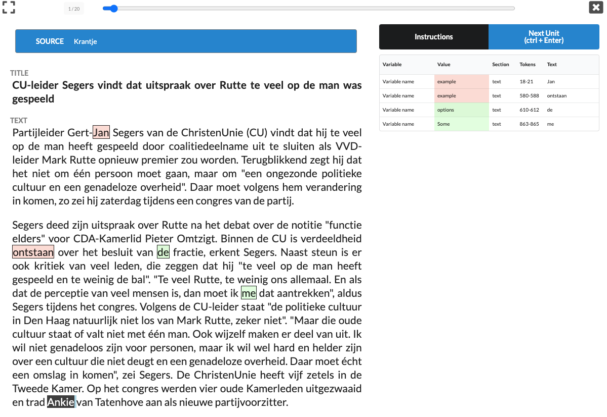

# Usage Manual for CCS Annotator

## Usage Manual

CCS Annotator is a tool for manual content analysis that is targeted specifically at the Computational Communication Science (CCS) community. CCS Annotatoris is designed to make the annotation tasks that our field (CCS) requires easier and more efficient to set-up and deploy, and to facilitate the development of reusable and shareable codebooks. It can be used by itself using only a standard web-browser, requiring no installation for either the researcher or coders. An additional CCS Annotator server backend can be installed for fast and efficient distribution of jobs and collection of results. CCS Annotator supports various annotations modes, ranging from expert tasks such as labeling specific words and phrases, to simple crowd coding tasks like Tinder style swiping on mobile phone.

The rest of this document provides a usage manual for CCS Annotator. Note that this manual concerns the base version (pulled from the GitHub repo) without any additional changes and modifications.

## CCS Annotator

The CCS Annotator functions as a webpage where the coding itself takes place. Coders can either follow a link to a coding job, or upload a coding job from a file. This link is the same one generated by the CCS Annotator Manager after coding job deployment.

Upon entering the URL on your (coder's) browser, the page prompts you to input a user name. This user name is stored with the coders annotations in order to track the job by each coder (for more advanced modes of authentication and authorization, check the Access Control section below). After this step, the coder can choose either the _fullscreen_ or the _windowed_ mode, the latter of which is useful for coders who use their smart phone for coding.

### Annotation task

If the coding job is an annotation task, the coder will see a webpage similar to this:

When the coder click on any work within the text, a pop-up window will appear with the possible codes (based on the codebook). Additionally, the coder can see the coded tokens (and their code) in the right hand side table. Lastly, the coder can click on the instructions button, whereby another pop-up window will appear showing the keyboard shortcuts for annotation. After the coder is finished annotating the current unit, the _NextUnit_ button will load the next unit to be annotated. The progress bar on top of the page shows the current status of the annotation task. Upon annotating the final unit, the finish button informs the coder that the job is finished.

### Question task

If the coding job is an question task, the coder will see a webpage similar to this:

The instructions for this task is relatively easier, as the coder only needs to click on the right answer for the question. Similar to the annotation task, the progress bar on top of the page shows the current status of the annotation task. Upon annotating the final unit, the finish button informs the coder that the job is finished.
