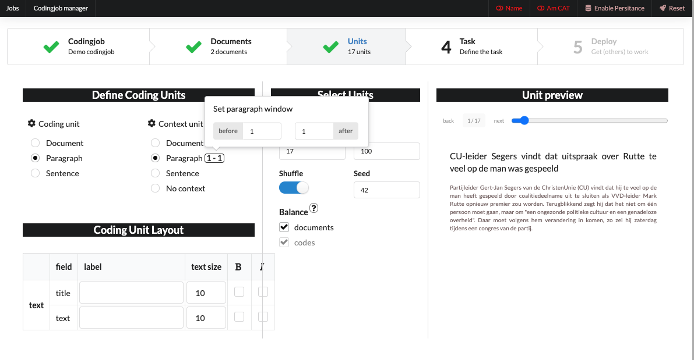
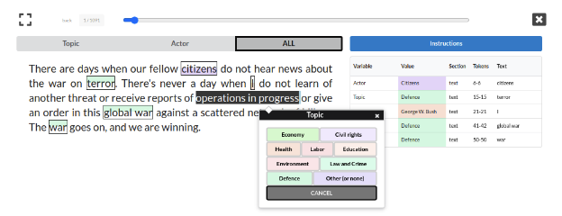
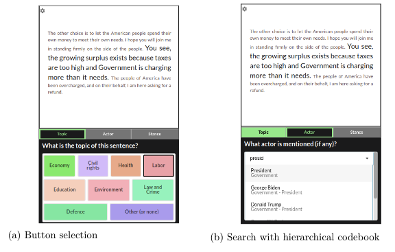
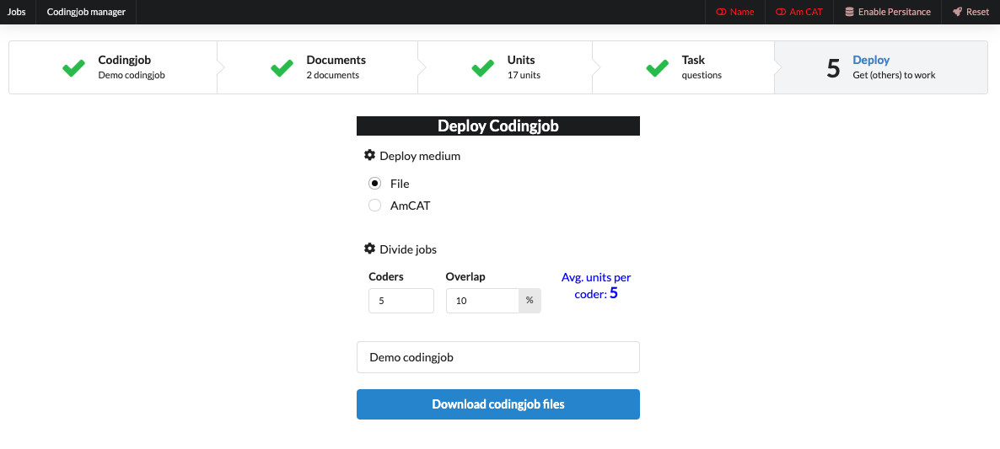
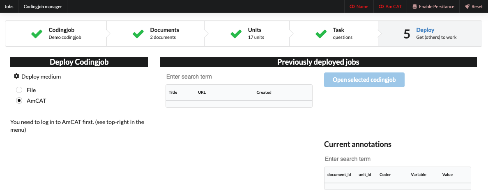
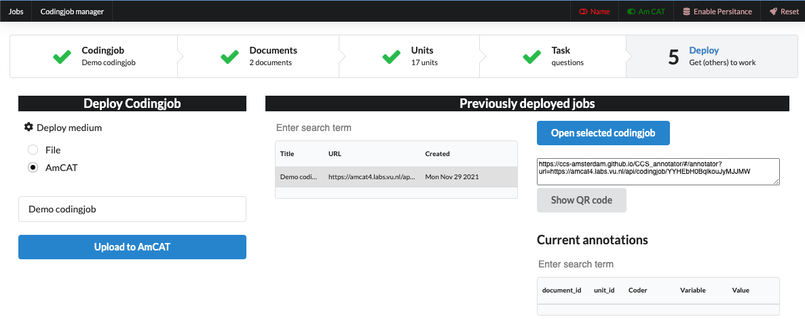

# Usage Manual for CCS Annotator

## Usage Manual

CCS Annotator is a tool for manual content analysis that is targeted specifically at the Computational Communication Science (CCS) community. CCS Annotatoris is designed to make the annotation tasks that our field (CCS) requires easier and more efficient to set-up and deploy, and to facilitate the development of reusable and shareable codebooks. It can be used by itself using only a standard web-browser, requiring no installation for either the researcher or coders. An additional CCS Annotator server backend can be installed for fast and efficient distribution of jobs and collection of results. CCS Annotator supports various annotations modes, ranging from expert tasks such as labeling specific words and phrases, to simple crowd coding tasks like Tinder style swiping on mobile phone.

The rest of this document provides a usage manual for CCS Annotator. Note that this manual concerns the base version (pulled from the GitHub repo) without any additional changes and modifications.

## CCS Annotator Manager

The CCS Annotator Manageris an mandatory component in which researchers can create coding jobs. Note that, coding jobs can also be created in software such as R or Python, for which we are working on a separate package and module, respectively.

To access the CCS Annotator Manager, first you need to run `npm start` in the project directory (check the installation guide). Afterwards, open a browser and visit `localhost:3000/CCS_Annotator`. The first time you do this, you come across the following page:

From the navigation pane on the top of this page, you can navigate through different steps of the process.

- **CodingJob**: You can create a new coding job by either clicking the **Create Demo Job**, or create one from scratch. In the latter case, you need to give the coding job a name.
- **Documents**: You can upload the documents you intend to annotate in this tab (in .csv format). In case you have already uploaded some documents, they will also be displayed in this page.

- **Units**: In the units page, you can determine the setup and specifics of the coding job you are intending to execute.

- In the **Define Coding Units** section, you can determine the granularity of the annotation you need, the options are document (using the whole document for annotation), paragraph (separating each document in annotatable paragraphs), and sentence (separating each document in annotatable sentences). You can also choose the **context unit** in which each annotation unit is displayed. For document, the context unit is always the whole document. However, for paragraph and sentence you can choose up to how many context units before and after the annotation unit you want to be displayed to the user (AKA the coder).

- In the **Coding Unit Layout** section you can customize the label, font, and styling of the test in the annotation units.
- In the **Select Units** section you can choose the randomization setting for the units. This affects how annotation units are selected and returned to the coders for annotation. You can choose the number of units per coder, randomization (and its seed), and sampling approach (balanced or on balanced). Consult the on-screen guide (under the question mark sign) for more information.
- In the **Unit Preview** section you can see how the units will look like to the coders. You can also scross through them using the navigation bar on top of this section.
- **Task**: In this tab, you can choose your annotation task type, and create your code book (and modify it if already created).

-- In the **Settings** section, you can select you task type (annotation mode). The current version supports two modes for coding texts. The _annotate_ mode lets coders assign labels to specific word or phrases. The below figure shows what this looks like for a task where coders can label topics and actors. For simple tasks, coders can intuitively select words with their mouse or touchpad (mobile), but faster keyboard navigation is also supported. On selection, a pop up lets users assign the label via an selected interface. For a small number of options this can be buttons. For a large number of options, this can also be a search box, and the codebook can have a tree structure to more easily search within categories.

You can also modify the codebook, add variables, change the tree structure of the codebook, and add additional codes.

The _question_ mode lets coders answer one or multiple (branching) questions about a given piece of text. Various formats for types of questions are available, and our goal is to add more and empirically test their efficacy for particular coding tasks. A key design principle for this annotation mode is that every type of question is fully and intuitively mobile phone compatible. Figure below illustrates what this looks like fora task where coders first answer whether/what topic is present in a sentence with buttons, and second whether/which actor is mentioned using a searchable list with a hierachical codebook. Only if both topic and actor are present, a follow up question would inquire about whether/what stance the actor takes on the issue.

In this mode, you cann add questions for each unit, and see how it is displayed on the preview tab. You can also choose to have three different modes of answering the question: (i) selecting code from a search box, (ii) selecting the code with buttons, and (iii) annoTinder, where you can swipe for yes/no questions.

- **Deploy**: In this page, you can choose how you want to deploy the coding job (refer to the CCS Annotator modules for more details).
  -- If you choose the **File** option, you will be able to indicate the number of coder and the overlap, and in turn are able to download a zip file containing the coding job (units + codebook) for each coder. This zip file can be used for with other annotation systems, or the Annotator module.

-- if you choose the **AmCAT** option, you can store your coding jobs on AmCAT, and use the functionalities that it provides (safe storage, access control) for your annotation job.

Note that in this case, you need to have a running AmCAT server. Visit [AmCAT 4.0 GitHub Repo](https://github.com/ccs-amsterdam/amcat4) for more details. To login to AmCAT, use the AmCAT tab on the top of the page. After a successfull login, you are returned to the deploy page, where you can give a name to your coding job, and upload it to AmCAT. After this, you can see the link of the coding job, as well as a QR-code which can be distributed to the coders.

