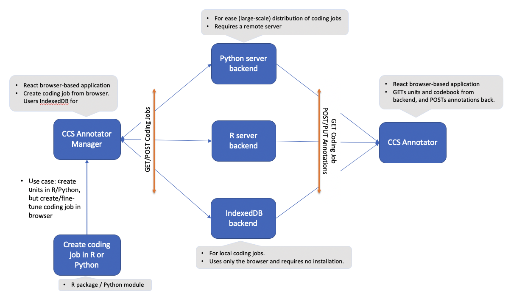

# CCS Annotator

This is the ReactJS Client for the CCS Annotator.
It is currently in active development, and the codebase can still change substantially.
As such, you are very much invited to install it to try it out and provide feedback,
and if you are interested in contributing to development or using certain components, let us know!

## Intro

CCS Annotator is a tool for manual content analysis that is targeted specifically at the Computational Communication Science (CCS) community. CCS Annotatoris is designed to make the annotation tasks that our field (CCS) requires easier and more efficient to set-up and deploy, and to facilitate the development of reusable and shareable codebooks. It can be used by itself using only a standard web-browser, requiring no installation for either the researcher or coders. An additional CCS Annotator server backend can be installed for fast and efficient distribution of jobs and collection of results. CCS Annotator supports various annotations modes, ranging from expert tasks such as labeling specific words and phrases, to simple crowd coding tasks like Tinder style swiping on mobile phone.

## Installation and Run

Installation should be straightforward via npm.

```bash
git clone https://github.com/ccs-amsterdam/CCS_annotator
cd CCS_annotator
npm install
npm start
```

Depending on your env, you might have to run `npm install --only=dev` to install dev dependencies.

- Currently there is a new error for npm installs for Mac users. If after installation you still cannot reach the webclient, run `unset HOST` in your terminal before `npm start`. Here is the link to the open issue: [Github Issue](https://github.com/facebook/create-react-app/issues/9619).

## CCS Annotator Modules

Depending on the applicaiton and its requirements, CCS Annotator can have various setups. The most complete (and powerful) version is depicted below:


In this setup, there are 5 modules composing the CCS Annotator: CCS Annotator Manager (mandatory), CCS Annotator (Optional), Text Analysis Infrastructure (optional), CCS Annotator Backend (optional), and the Databset (optional). The mandatory modules are always required for any setup, while the optional ones can be substituted and modified depending on the application. Note that currenlty the CCS Annotator module is hosted on Github by us, thus no installation is required from you. If you wish to set up your own CCS Annotator module, you can do so on another server and change the host in the CCS Annotator Manager. Few alternative setups are depicted in the figure below:



For more information about CCS Annotator modules, check here: [Extended Abstract ICA](extended-abstract-papaer)

## Advanced Usage

In this section we discuss few more advance topics when using the CCS Annotator.

### Creating a Codebook

### Question Branching

### Access Control

Currenlty, there are three modes of access control supported by the CCS Annotator. Note that for these modes, you need the full implementation of the CCS Annotator + AmCAT. These modes are indicated when creating the coding book in the **rules** section. three modes are:

- **user**: This mode is mostly used in crowd-coding scenarios, where the users are only asked for a (unique) username, and their annotations are stored alongside their username. This way, the annotaions, their quality, and coders' contribution (and maybe compensation) can be calcualted when the job is finished.
- **user_pass**: This mode is used when there are a list of pre-determined users (for instance in an expert study) who have access to the coding job. These users are added to the AmCAT by the CCS Annotator Manager before the access link is shared. Note that this authentication marks the difference between _public_ coding jobs (crowd-coding) and _private_ jobs.
- **token**: This mode can be used where the coding job is private, but there is no need to pre-determine the coders and add them to AmCAT. For instance, this mode can be used when the coding job is for a class of students, but no one outside of it. In this mode a token is given alongside the access link, which acts as the authentication mechanism.

-- We are planning to move the access control mechanism to an email-based token system, where coders input their email, and receive and access-link + token in their mailbox.
